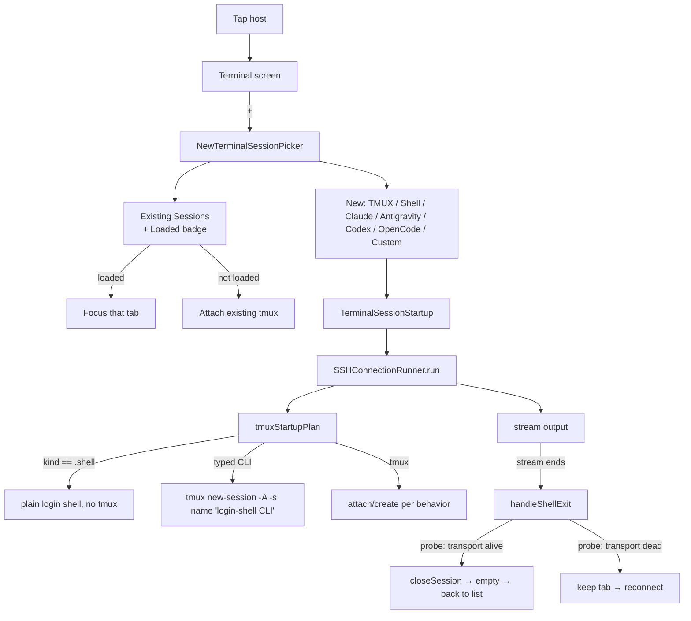

# paullm-ssh — Continuation Plan & Session Log

> Working context for resuming this work from the CLI. Last updated 2026-09-21.
> Branch: `remediation/full-ship` — working tree **clean**; everything through the
> Aug 22 About-page fixes and TestFlight build `2026.822.906` is committed and
> shipped. (The old notes about "lots of uncommitted work on
> `codex/typed-coding-sessions`" are resolved — that work landed on
> `remediation/full-ship`, now 61 commits ahead, and most of it is live on
> TestFlight.)

---

## 1. Status snapshot

- **App:** `app.paullm.ssh` ("PAULLM SSH"), App Store Connect app id `6775278799`,
  team `E4WZK7V29T`, marketing version **2.1**, automatic signing.
- **TestFlight:** internal group **"PAULM"** (`hasAccessToAllBuilds = true`) — new
  builds auto-attach; the tester just taps **Update** in the TestFlight app.
- **Latest build live:** `2026.822.906` (uploaded 2026-08-22, `processingState:
  VALID`) — the About-page upload (website/privacy/support → paullm.com, upstream
  VVTerm identity replaced with our own, GPL-3.0 licensing/attribution pass).
  Also VALID: `2026.822.749` (2.1 train), `2026.817.8`, `2026.701.848`,
  `2026.701.829`. Query build state via the API in §3.
- **Encryption compliance:** iOS `Info.plist` sets `ITSAppUsesNonExemptEncryption =
  false`, so TestFlight does not prompt. ⚠️ Re-evaluate before a public App Store
  release — this is an SSH client (libssh2/OpenSSL); the "no non-exempt encryption"
  claim is a real compliance judgement.

---

## 2. What's shipped on `remediation/full-ship` (all committed, all on TestFlight)

Everything from the May/June sessions has been committed and released. Highlights:

### 2.1 tmux session loading ("Failed to request shell" + blank-screen attach)
Root cause was a heavyweight per-attach login-env harvest and a deeply shell-quoted
inline CLI installer wrapped in interactive shells.
- `Core/SSH/RemoteTmuxManager.swift` — restored lightweight `shellPathExport()`
  attach; env-harvest removed from the attach/create path.
- `Core/SSH/RemoteTerminalBootstrap.swift` — `loginShellCommand` uses a single
  non-interactive **login** shell (`exec "$SHELL" -lc '<cmd>'`).
- `Core/SSH/RemoteEnvironmentResolver.swift` — empty command → `.shell` plan.

### 2.2 Crash: closing the last session aborts (`swift_deallocClassInstance`)
`deinit` in the terminal coordinators did `Task { @MainActor [self] in … }` —
capturing `self` mid-dealloc → `abort()`. Fixed with captured values, never `self`.
- `Features/TerminalSessions/UI/Terminal/SSHTerminalWrapper.swift`

### 2.3 CLI exit → disconnect when tmux empty → back to server list
`ConnectionSessionManager.handleShellExit` probes the transport: answers → session
genuinely ended → `closeSession`; dead → network drop → keep tab for reconnect.

### 2.4 Tailscale detect + prompt (when no servers configured)
`Core/Network/TailscaleNetworkDetector.isOnTailnet()` checks interfaces for
`100.64.0.0/10` / `fd7a:115c:a1e0::/48`; empty state offers "Add Tailscale Host";
`ServerFormPrefill.connectionMode` opens the form in Tailscale mode.

### 2.5 "+" picker shows existing sessions (with Loaded badge)
`NewTerminalSessionPicker` has an "Existing Sessions" section; tapping a loaded
session focuses its tab, otherwise attaches. ⚠️ **iOS-only** — macOS
`ConnectionTabsView.swift` still uses the new-options-only picker (see §5.2).

### 2.6 Plain "Shell" session kind (non-tmux, no command)
`TerminalSessionKind.shell` skips tmux in `tmuxStartupPlan` on both platforms.

### 2.7 Also shipped since
- Inline compose box with send modes (local InputBuffer composer docked in the
  session view).
- Live tmux-sessions stats card with per-session kill control.
- Host-key trust flow: typed host-key errors, explicit trust for unknown keys,
  recovery prompt for changed keys, known-hosts list in Settings with removal,
  Keychain-backed storage (migrated from UserDefaults).
- Remote directory picker in the new-session flow; custom session kinds.
- Adaptive I/O-loop poll backoff (fewer idle wakeups); remote stderr redaction.
- Web: marketing site rebuilt on Next.js.
- Docs/compliance: App Store readiness audit, GPL-3.0 licensing + attribution,
  About page points at paullm.com, corrected credential-sync/CloudKit claims.

---

## 3. Release / TestFlight runbook

Identifiers (Key ID / Issuer ID are non-secret; the `.p8` is the credential — keep it
out of git):

- API key: `~/.appstoreconnect/private_keys/AuthKey_M6262AX69L.p8`
- Key ID: `M6262AX69L`   Issuer ID: `69a6de72-3c0c-47e3-e053-5b8c7c11a4d1`
- Export config: `ExportOptions.plist` (repo root; method `app-store-connect`,
  destination `upload`, automatic signing, team `E4WZK7V29T`).

**Prefer the `ship-testflight` skill** — it handles sandbox/keychain gotchas: disable
the sandbox for codesign, and unlock + `security set-key-partition-list` the login
keychain (empty password: `-p ''`) before **each** archive AND **each** export.

### Bump build number (must be unique & each dotted component < 2^31)
```bash
CUR=$(grep -m1 "CURRENT_PROJECT_VERSION = " paullm-ssh.xcodeproj/project.pbxproj | sed 's/.*= //; s/;//')
NEW="2026.$(date +%-m%d).$(date +%H%M)"
sed -i '' "s/CURRENT_PROJECT_VERSION = $CUR;/CURRENT_PROJECT_VERSION = $NEW;/g" paullm-ssh.xcodeproj/project.pbxproj
```

### Archive (auto-creates distribution cert/profile via the API key)
```bash
xcodebuild archive -project paullm-ssh.xcodeproj -scheme paullm-ssh \
  -configuration Release -destination 'generic/platform=iOS' \
  -archivePath build/paullm-ssh.xcarchive -allowProvisioningUpdates \
  -authenticationKeyPath ~/.appstoreconnect/private_keys/AuthKey_M6262AX69L.p8 \
  -authenticationKeyID M6262AX69L \
  -authenticationKeyIssuerID 69a6de72-3c0c-47e3-e053-5b8c7c11a4d1
```

### Export + upload to TestFlight
```bash
xcodebuild -exportArchive -archivePath build/paullm-ssh.xcarchive \
  -exportOptionsPlist ExportOptions.plist -exportPath build/export \
  -allowProvisioningUpdates \
  -authenticationKeyPath ~/.appstoreconnect/private_keys/AuthKey_M6262AX69L.p8 \
  -authenticationKeyID M6262AX69L \
  -authenticationKeyIssuerID 69a6de72-3c0c-47e3-e053-5b8c7c11a4d1
# success line: "Progress NN%: Upload succeeded." / "** EXPORT SUCCEEDED **"
```

### Check app / build / group status via the API
Mint an ES256 JWT (iss=Issuer, aud=`appstoreconnect-v1`, kid=Key ID; needs
`pyjwt` + `cryptography`) and GET:
- `/v1/apps?filter[bundleId]=app.paullm.ssh`
- `/v1/builds?filter[app]=6775278799&sort=-uploadedDate` (look for `processingState`)
- `/v1/apps/6775278799/betaGroups`

### Quick verify before archiving
```bash
xcodebuild build -project paullm-ssh.xcodeproj -scheme paullm-ssh \
  -configuration Debug -destination 'platform=iOS Simulator,name=iPhone 17 Pro'
```

### Crash symbolication
`.ips` files: retrieve from the device via Xcode → Window → Devices and
Simulators → View Device Logs, or `~/Library/Logs/DiagnosticReports/` on Mac.
dSYM is in the archive at `build/paullm-ssh.xcarchive/dSYMs/...`. Match
`slice_uuid` to the dSYM UUID; `atos -arch arm64 -o <DWARF> -l <imageBase>
<imageBase+offset>`. Async funclet frames often resolve to nearest-symbol noise —
lean on the runtime frames + reasoning.

---

## 4. Workflow reference (current behavior)



---

## 5. Outstanding work / next steps

1. **AI Toolkit design (waiting on dev specs).** Decide the fate of the now-unused
   inline-install code: `RemoteTerminalBootstrap.configuredCLIStartupScript`,
   `CLIInstaller`, and `loginEnvironmentImportScript` (still defined + unit-tested
   but no longer called from the launch path). The Toolkit feature
   (`Features/Toolkit/`) is the intended install/detect/verify path — reconcile the
   two so there's one install mechanism.
2. **macOS parity:** wire existing-sessions into `ConnectionTabsView` picker via
   `TerminalTabManager`.
3. **Dead-code cleanup** once the toolkit decision is made.
4. **Encryption compliance** review before public release.
5. **Branch hygiene:** `remediation/full-ship` is 61 commits ahead of main and the
   active ship line — decide whether to merge to `main` / make it the default
   before starting big new work.

### UX backlog (identified, not yet addressed)
- Serial first-paint: tmuxStartupPlan does 4–6 sequential SSH `exec` round-trips
  (supportsTmuxRuntime → isTmuxAvailable → listSessions → cleanup → prepareConfig →
  currentPath) before the PTY appears. Parallelize/cache per connection.
- Two competing CLI-install mechanisms (inline vs Toolkit).
- Reconnect storms on foreground (each pane reconnects independently; no throttle).
- Prompt/alert collisions (tmux-attach sheet vs Install-tmux vs Install-mosh).
- Duplicated orchestration between `ConnectionSessionManager` (iOS) and
  `TerminalTabManager` (macOS) — drift risk.

---

## 6. Resume checklist (from CLI)

- Read this file + `CLAUDE.md`.
- `git status` — the tree should be clean; confirm you're on `remediation/full-ship`.
- To ship: **use the `ship-testflight` skill** (or §3 manually: bump build →
  archive → export/upload).
- Newest crash logs: retrieve from the device (Xcode → Devices → View Device Logs)
  or `~/Library/Logs/DiagnosticReports/` on Mac. Vault notes for this project live
  on **delllap**: `ssh delllap`, `~/ObsidianVault_Final/PROJECTS/paullm-ssh/`
  (no local `~/vault` on the Mac).
- Confirm the tester is on the latest build (TestFlight → Update); stale-build
  crash reports are almost always already-fixed.
