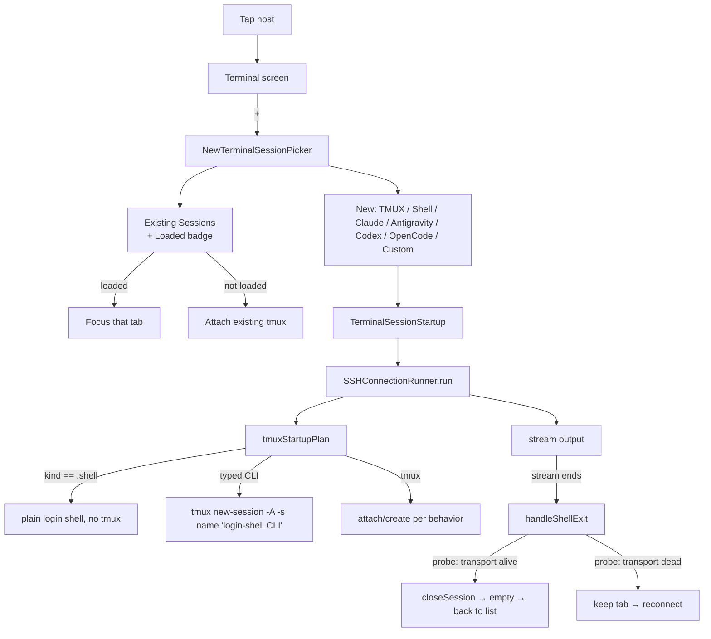

# paullm-ssh — Continuation Plan & Session Log

> Working context for resuming this work from the Claude CLI. Last updated 2026-05-31.
> Branch: `codex/typed-coding-sessions`. Lots of uncommitted work in the tree (the
> in-progress Toolkit feature **plus** the fixes below). Nothing here has been
> committed yet — see "Git / commit strategy".

---

## 1. Status snapshot

- **App:** `app.paullm.ssh` ("PAULLM SSH"), App Store Connect app id `6775278799`,
  team `E4WZK7V29T`, marketing version **2.1**, automatic signing.
- **TestFlight:** internal group **"PAULM"** (`hasAccessToAllBuilds = true`) — new
  builds auto-attach; the tester just taps **Update** in the TestFlight app.
- **Latest build pushed:** `2026.531.1848` (build-number scheme is
  `YYYY.{M}{dd}.{HHMM}` — see runbook). Earlier builds: 1432 (first), 1657, 1727,
  1834, 1848. Builds 1828 was archived but never uploaded (superseded).
- **Encryption compliance:** iOS `Info.plist` sets `ITSAppUsesNonExemptEncryption =
  false`, so TestFlight does not prompt. ⚠️ Re-evaluate before a public App Store
  release — this is an SSH client (libssh2/OpenSSL); the "no non-exempt encryption"
  claim is a real compliance judgement.

---

## 2. What was fixed/added this session (all in the working tree)

### 2.1 tmux session loading ("Failed to request shell" + blank-screen attach)
Root cause: a prior change added a heavyweight per-attach login-env harvest
(`$SHELL -lic env`) and an inline CLI installer wrapped in interactive shells,
shell-quoted 2–3 layers deep. That made the exec channel request fail (new typed
sessions) and stalled the env harvest before `tmux attach` (existing sessions → blank).

- `Core/SSH/RemoteTmuxManager.swift` — restored lightweight `shellPathExport()`
  attach; removed `loginEnvironmentImportScript()` + `refreshTmuxEnvironmentCommand()`
  from the attach/create path; CLI now launched via `loginShellCommand`.
- `Core/SSH/RemoteTerminalBootstrap.swift` — `loginShellCommand` now uses a single
  non-interactive **login** shell (`exec "$SHELL" -lc '<cmd>'`) — login resolves
  PATH (Homebrew/npm/`~/.local/bin`) without the interactive hang.
- `Core/SSH/RemoteEnvironmentResolver.swift` — empty command → `.shell` plan.

### 2.2 Crash: closing the last session aborts (`swift_deallocClassInstance`)
`deinit` in both iOS/macOS terminal coordinators did `Task { @MainActor [self] in
cancelShell() }` — capturing `self` strongly resurrects an object mid-dealloc →
`abort()`. Fixed by doing the cleanup with **captured values, never `self`**.
- `Features/TerminalSessions/UI/Terminal/SSHTerminalWrapper.swift` (two deinits).

### 2.3 CLI exit → disconnect when tmux empty → back to server list
Quitting Claude/Codex/Antigravity used to leave a frozen "stalled" terminal.
- `Features/TerminalSessions/Application/ConnectionSessionManager.swift` —
  `handleShellExit` now probes the transport with a trivial remote command:
  if it answers → the tmux session genuinely ended (empty) → `closeSession`; if not
  → a network drop → keep the tab for reconnect. Closing the last session empties
  `sessions`, and existing nav (`iOSContentView` `onChange(sessions)`) returns to the
  server list.

### 2.4 Tailscale detect + prompt (when no servers configured)
Lightweight, on-device, no auth (can't enumerate a tailnet from a sandboxed app).
- `Core/Network/TailscaleNetworkDetector.swift` (new) — `isOnTailnet()` checks
  interfaces for `100.64.0.0/10` or `fd7a:115c:a1e0::/48`.
- `Core/UI/EmptyStateViews.swift` — "Add Tailscale Host" button.
- `Features/LocalDiscovery/Domain/DiscoveredSSHHost.swift` — `ServerFormPrefill`
  gained `connectionMode`; `ServerFormSheet` honors it (opens in Tailscale mode).
- `App/iOS/iOSContentView.swift` — detects tailnet `onAppear`, shows the button.

### 2.5 "+" picker shows existing sessions (with Loaded badge)
- `Features/TerminalSessions/UI/NewSession/NewTerminalSessionPicker.swift` —
  "Existing Sessions" section + `existingSessionRow` + Loaded badge.
- `App/iOS/iOSContentView.swift` — passes the live remote session list + loaded
  names + `onAttachExisting` (focus if loaded, else attach); refreshes on open.
- ⚠️ macOS `ConnectionTabsView.swift:237` still uses the new-options-only picker
  (defaulted params). Wire it via `TerminalTabManager` if macOS parity is wanted.

### 2.6 Plain "Shell" session kind (non-tmux, no command)
- `Features/TerminalSessions/Domain/TerminalSessionStartup.swift` — new
  `TerminalSessionKind.shell` + `TerminalSessionStartup.shell`.
- `tmuxStartupPlan` (both `ConnectionSessionManager` and `TerminalTabManager`) skips
  tmux for `.shell`.
- Picker has a **Shell** row ("Plain SSH shell, no tmux").

---

## 3. Release / TestFlight runbook

Identifiers (Key ID / Issuer ID are non-secret; the `.p8` is the credential — keep it
out of git):

- API key: `~/.appstoreconnect/private_keys/AuthKey_M6262AX69L.p8`
- Key ID: `M6262AX69L`   Issuer ID: `69a6de72-3c0c-47e3-e053-5b8c7c11a4d1`
- Export config: `ExportOptions.plist` (repo root; method `app-store-connect`,
  destination `upload`, automatic signing, team `E4WZK7V29T`).

### Bump build number (must be unique & each dotted component < 2^31)
```bash
CUR=$(grep -m1 "CURRENT_PROJECT_VERSION = " paullm-ssh.xcodeproj/project.pbxproj | sed 's/.*= //; s/;//')
NEW="2026.$(date +%-m%d).$(date +%H%M)"
sed -i '' "s/CURRENT_PROJECT_VERSION = $CUR;/CURRENT_PROJECT_VERSION = $NEW;/g" paullm-ssh.xcodeproj/project.pbxproj
```

### Archive (auto-creates distribution cert/profile via the API key)
```bash
xcodebuild archive -project paullm-ssh.xcodeproj -scheme paullm-ssh \
  -configuration Release -destination 'generic/platform=iOS' \
  -archivePath build/paullm-ssh.xcarchive -allowProvisioningUpdates \
  -authenticationKeyPath ~/.appstoreconnect/private_keys/AuthKey_M6262AX69L.p8 \
  -authenticationKeyID M6262AX69L \
  -authenticationKeyIssuerID 69a6de72-3c0c-47e3-e053-5b8c7c11a4d1
```

### Export + upload to TestFlight
```bash
xcodebuild -exportArchive -archivePath build/paullm-ssh.xcarchive \
  -exportOptionsPlist ExportOptions.plist -exportPath build/export \
  -allowProvisioningUpdates \
  -authenticationKeyPath ~/.appstoreconnect/private_keys/AuthKey_M6262AX69L.p8 \
  -authenticationKeyID M6262AX69L \
  -authenticationKeyIssuerID 69a6de72-3c0c-47e3-e053-5b8c7c11a4d1
# success line: "Progress NN%: Upload succeeded." / "** EXPORT SUCCEEDED **"
```

### Check app / build / group status via the API
`pip install --user pyjwt cryptography`, then mint an ES256 JWT (iss=Issuer,
aud=`appstoreconnect-v1`, kid=Key ID) and GET:
- `/v1/apps?filter[bundleId]=app.paullm.ssh`
- `/v1/builds?filter[app]=<id>&sort=-uploadedDate` (look for `processingState`)
- `/v1/apps/<id>/betaGroups`

### Quick verify before archiving
```bash
xcodebuild build -project paullm-ssh.xcodeproj -scheme paullm-ssh \
  -configuration Debug -destination 'platform=iOS Simulator,name=iPhone 17 Pro'
# targeted tests:
xcodebuild test ... -only-testing:paullm-sshTests/RemoteTmuxManagerParserTests \
  -only-testing:paullm-sshTests/RemoteTerminalBootstrapTests
```

### Crash symbolication
`.ips` files: retrieve from the device via Xcode → Window → Devices and
Simulators → View Device Logs, or `~/Library/Logs/DiagnosticReports/` on Mac.
dSYM is in the
archive at `build/paullm-ssh.xcarchive/dSYMs/...`. Match `slice_uuid` to the dSYM
UUID; `atos -arch arm64 -o <DWARF> -l <imageBase> <imageBase+offset>`. Async funclet
frames often resolve to nearest-symbol noise — lean on the runtime frames + reasoning.

---

## 4. Workflow reference (current behavior)



---

## 5. Outstanding work / next steps

1. **AI Toolkit design (waiting on dev specs).** Decide the fate of the now-unused
   inline-install code: `RemoteTerminalBootstrap.configuredCLIStartupScript`,
   `CLIInstaller`, and `loginEnvironmentImportScript` (still defined + unit-tested but
   no longer called from the launch path). The Toolkit feature
   (`Features/Toolkit/`) is the intended install/detect/verify path — reconcile the
   two so there's one install mechanism (UX issue #1 below).
2. **macOS parity:** wire existing-sessions into `ConnectionTabsView` picker via
   `TerminalTabManager`.
3. **Git:** commit the working tree as atomic commits (see strategy below).
4. **Dead-code cleanup** once the toolkit decision is made.
5. **Encryption compliance** review before public release.

### UX backlog (identified, not yet addressed)
- Serial first-paint: tmuxStartupPlan does 4–6 sequential SSH `exec` round-trips
  (supportsTmuxRuntime → isTmuxAvailable → listSessions → cleanup → prepareConfig →
  currentPath) before the PTY appears. Parallelize/cache per connection.
- Two competing CLI-install mechanisms (inline vs Toolkit).
- Reconnect storms on foreground (each pane reconnects independently; no throttle).
- Prompt/alert collisions (tmux-attach sheet vs Install-tmux vs Install-mosh).
- Duplicated orchestration between `ConnectionSessionManager` (iOS) and
  `TerminalTabManager` (macOS) — drift risk.

---

## 6. Git / commit strategy

The branch has the WIP **Toolkit** feature plus all the fixes above, intermixed in
the same files — they were never committed during this session. Suggested atomic
sequence when ready (per repo `CLAUDE.md` commit rules):
1. tmux loading fix (`RemoteTmuxManager`, `RemoteTerminalBootstrap`,
   `RemoteEnvironmentResolver`, tests).
2. disconnect crash fix (`SSHTerminalWrapper`).
3. CLI-exit → disconnect (`ConnectionSessionManager`).
4. Tailscale detect + prompt (Core/Network, Core/UI, LocalDiscovery, Servers/UI, App/iOS).
5. existing-sessions picker (`NewTerminalSessionPicker`, App/iOS).
6. Shell session kind (`TerminalSessionStartup`, managers, picker).
7. release config (`ExportOptions.plist`, build-number bump) — keep separate.

Commit trailer: `Co-Authored-By: Claude Opus 4.8 <noreply@anthropic.com>`.

---

## 7. Resume checklist (from CLI)

- Read this file + `CLAUDE.md`.
- `git status` to see the uncommitted surface.
- To ship: bump build number → archive → export/upload (section 3).
- Newest crash logs: retrieve from the device (Xcode → Devices → View Device
  Logs) or `~/Library/Logs/DiagnosticReports/` on Mac; the old
  `~/ObsidianVault_Final/PROJECTS/paullm-ssh/` path is gone.
- Confirm the tester is on the latest build (TestFlight → Update); stale-build crash
  reports (e.g. build 1432) are almost always already-fixed.
